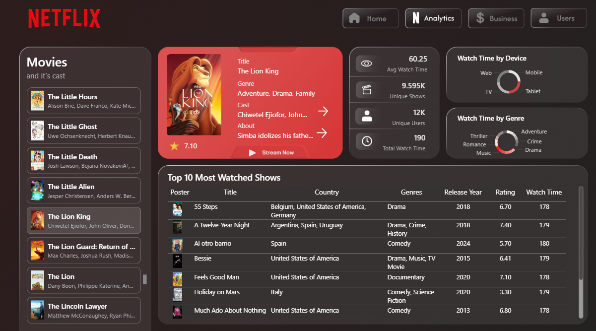
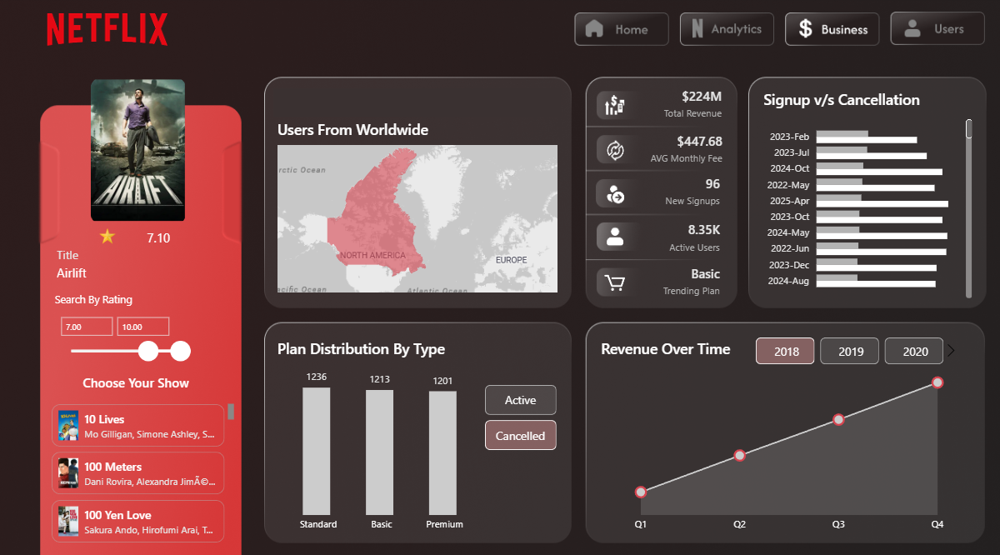
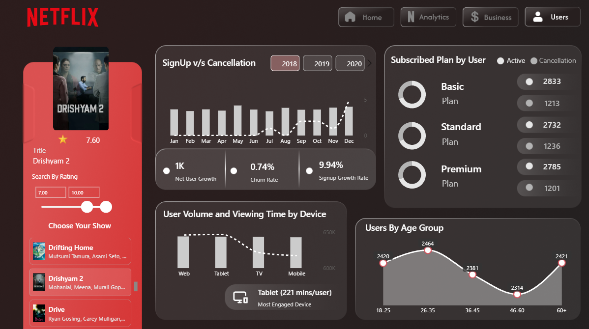

# 🎬 Netflix Analytics Dashboard (End-to-End Power BI Project)

> A complete **data analytics project** built using **Excel, SQL, Python, and Power BI**, replicating Netflix’s analytical ecosystem — analyzing user behavior, engagement, subscriptions, and revenue trends.


## 🧩 Project Overview

This project simulates how Netflix might analyze its user base and content performance using data.  
I built everything from scratch — from **data cleaning and transformation** to **interactive Power BI dashboards** — to uncover how users watch, subscribe, and engage.

📊 **Goal:**  
To design a realistic business-ready dashboard that answers questions like:
- Which devices drive the most engagement?
- Which genres dominate total watch time?
- How does churn affect revenue growth?
- Which subscription plans bring the most value?


## ⚙️ Tech Stack

| Tool | Purpose |
|------|----------|
| 🐍 **Python** | Data enrichment (via TMDB API) & dataset generation |
| 🗃️ **PostgreSQL** | Data cleaning, modeling, and relationships |
| 📊 **Power BI** | Dashboard visualization & storytelling |
| 📁 **Excel** | Initial data inspection & verification |
| 🔗 **TMDB API** | Movie and show metadata collection (posters, type, etc.) |


## 🧮 Dataset Overview

The dataset was custom-built to resemble a realistic Netflix ecosystem:

| Table | Description |
|--------|--------------|
| **netflix_data** | Movie/show metadata with poster URLs |
| **users** | User demographics, country, and device type |
| **subscriptions** | Subscription plan, start/end dates, and status |
| **watch_history** | User engagement and watch duration data |
| **revenue_summary** | Monthly revenue, signups, cancellations, active users |

📅 **Time Range:** 2018–2025  
📊 **Total Rows:** ~100,000 across all tables  


## 🧹 Data Processing Workflow


### Key Steps:
1. **Data Cleaning** in SQL (handling nulls, duplicates, and joins)
2. **Data Enrichment** using TMDB API (posters, type, ratings)
3. **Modeling Relationships** between tables (1-to-many and many-to-1 joins)
4. **Visualizations** using Power BI (with DAX measures for KPIs)


## 📈 Dashboard Overview

### 🟥 **Page 1: Revenue & User Overview**
- KPIs: Average Watch Time, Unique Shows, Unique Users, Total Watch Time
- Donut: Watch Time Share by Genre
- Donut: Watch Time Share by Device
- Table: Top 10 Most Watched Shows
- Card Visual: Show Description
- Slicer: Show Names With Images




### 🟩 **Page 2: Content Performance & Engagement**
- Slicer & Card Visual: Full Show Details, Search by Rating Slicer, Total Show List Slicer
- Map: Users Over The World
- Stacked Column Chart: Plan Distribution by Plan Type With Silcer Active/Cancelled Subscription
- KPIs: Total Revenue, Avg Monthly Fee, New Signups, Active Users, Most Purchased Plan
- Bar Chart: Signup v/s Cancellation by Year and Month
- Line Chart: Revenue Over Time by Quarter and Included Year Slicer


  


### 🟦 **Page 3: User Behavior & Subscription Trends**
- Slicer & Card Visual: Full Show Details, Search by Rating Slicer, Total Show List Slicer
- Line & Column Chart: Showing Signup v/s Cancellation With Year Slicer
- KPI's: Net User Growth, Churn Rate, Signup Growth, Most Engaged Device(TV/Web/Mobile)
- Donut: Subscribe by Plan, Active and Cancelled User
- Area Chart: Users by Age Group




## 💡 Key Insights

| Insight | Description |
|----------|--------------|
| 🎥 **TV users** | Represent only 25% of users but drive 60% of total watch time |
| 📱 **Mobile users** | Majority of user base, but least engaged per session |
| 🎭 **Drama & Crime** | Top genres by engagement and popularity |
| 💔 **Churn Rate** | Only 0.74% — Netflix retains most users |
| 💸 **Revenue Growth** | Consistent upward trend post-2022 |
| 🔁 **Premium Plans** | Highest contribution to total revenue |


## 📊 Sample SQL Queries
The following **SQL VIEWS** were created and then imported into Power BI (PBI) for analysis:

```sql
-- Created VIEWS, imported into PBI
CREATE OR REPLACE VIEW netflix_data_2
AS
SELECT *,
    split_part(genres, ',', 1) AS extracted_genres,
		first_3_genres(genres) AS top_genres,
		CASE
			WHEN rating= 0.00 THEN 'Not Rated'
			ELSE rating::text
		END rating_revised,
		CAST((release_year/10)*10 AS INTEGER) AS decade
FROM netflix_data
WHERE director IS NOT NULL
  AND "cast" IS NOT NULL
  AND country IS NOT NULL
  AND genres IS NOT NULL
  AND description IS NOT NULL
  AND poster_url IS NOT NULL;

-- VIEWS - watch_history
CREATE OR REPLACE VIEW watch_history_2 
AS
SELECT *,
      TO_CHAR(watch_date, 'DDD') AS watch_day,
			EXTRACT(DOW FROM watch_date) AS day_of_week
FROM watch_history
WHERE show_id IN (
		SELECT show_id
		FROM netflix_data
		WHERE director IS NOT NULL
		  AND "cast" IS NOT NULL
		  AND country IS NOT NULL
		  AND genres IS NOT NULL
		  AND description IS NOT NULL
		  AND poster_url IS NOT NULL
);
```

## 📊 Power BI DAX Highlights

> ```DAX
> Net User Growth =
> [Monthly Signups] - [Monthly Cancellations]
> ```


> ```DAX
> Churn Rate (%) =
> DIVIDE(
>     [Monthly Cancellations],
>     [Monthly Signups] + [Monthly Cancellations]
> )
> ```


> ```DAX
> Signup Growth Rate (%) =
> VAR PrevMonth =
>     CALCULATE([Monthly Signups], DATEADD(Calendar[Date], -1, MONTH))
> RETURN
> DIVIDE([Monthly Signups] - PrevMonth, PrevMonth)
> ```

---
## 👨‍💻 About Me

Hi, I’m **Gaurav Khanna**, a Data Analyst passionate about turning complex data into simple, impactful insights.  
Skilled in **Power BI, SQL, Excel, and Python**, I love building dashboards that tell a story and uncover hidden trends.


## 🤝 Connect with Me

🌐 **Portfolio:** [https://gouravkhanna03.github.io/portfolio/]  
💼 **LinkedIn:** [[your LinkedIn profile](https://www.linkedin.com/in/gauravkhanna03/)]  
📧 **Email:** [gouravkhanna03@gmail.com]


## 🔖 Keywords

`Power BI` `SQL` `Data Analytics` `Netflix Dashboard` `Python` `Data Visualization` `ETL` `Data Cleaning` `Storytelling with Data` `Dashboard Design` `SQL` `PBI Dashboard`
